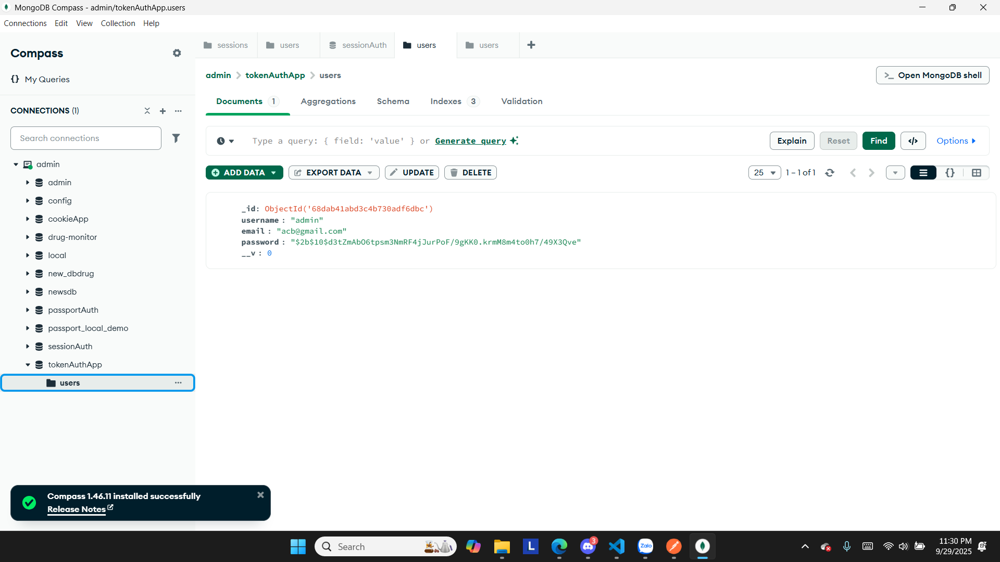

# token_auth
# 1. Chạy node app.js

# 2. Chạy vô đường link kiểm tra profile

# 3. Đăng ký tài khoản với username, password, email

# Kiểm tra database để xem thông tin người dùng đăng ký đã được lưu

# 4. Đăng nhập vào tài khoản và kiểm tra có token

# 5. Vào trang profile với token
